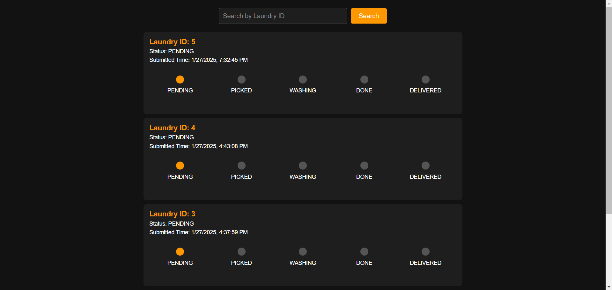

# Online-Laundry-Service

## About the Project
The Online Laundry Service is a web application designed to streamline the process of managing laundry services for students. It provides a user-friendly interface for users to submit their laundry, track the status of their laundry, and update their profiles. Admins can manage the laundry status and view all laundry submissions.

### 💡Motivation
- Firstly, there were long lines where people had to stand to give their clothes for laundry servicing, this was altogether a very time-consuming process.
- Secondly, for writing the list of clothes the person uses a lot of paper which results in plenty of wastage of paper.
- The project aims to address problems with the current laundry system. Instead of using paper slips, the proposed solution involves creating a website for students at IIT Jodhpur and the laundry service. Students will input their laundry details on the website, and the laundry guy will have access to admin page to manage the laundry. This online system will save time and reduce the risk of losing paper slips. 

---

## Features
- User Authentication: Users can sign up, log in, and log out securely.
- Profile Management: Users can update their profile information.
- Laundry Submission: Users can submit their laundry with details and images.
- Status Tracking: Users can track the status of their laundry submissions.
- Admin Dashboard: Admins can view and update the status of all laundry submissions.
- Search Functionality: Admins can search for laundry submissions by ID.

---

## Technologies Used
- **Frontend:**
  - HTML, CSS, JavaScript
  - Frameworks/Libraries: None
- **Backend:**
  - Java, Spring Boot
  - Frameworks/Libraries: Spring Security, JPA, Lombok
- **Database:**
  - MySQL
- **Build Tools:**
  - Maven

## Getting Started
To get a local copy up and running, follow these steps:

### Prerequisites
- Java 17 or higher
- Maven
- MySQL

### Installation
1. Clone the repository:
   ```sh
   git clone https://github.com/your-username/Online-Laundry-Service.git
   cd Online-Laundry-Service
2. Set up the database:
    - Create a MySQL database named "laundry".
    - Import the SQL dump file located at DataBase/DumpFile.sql.
3. Configure the database connection:
    - Update the database configuration in **Backend/laundry/src/main/resources/application.properties** with your MySQL credentials.
4. Build and run the backend:
    ```sh
    cd Backend/laundry
    mvn clean install
    mvn spring-boot:run
5. Serve the frontend:
    - Open a new terminal and navigate to the Frontend directory.
    - Serve the frontend files using a static server or your preferred method.

---

## How to Run the Project
1. Start the backend server by running the Spring Boot application.
2. Open the frontend in your browser by navigating to the appropriate URL (e.g., http://localhost:8080).

---

## Demo
### Login
This is the starting point of our website if you are a new user, just create a new entry in no time.


### Registartion 
The entries are stored in MySQL database. From that you can find out if the person is already register or not. If yes, you will again redirect to Login.


### User Dashboard
This is user dashboard, from here user will be able to submit there laundry and also will be able see the there past laundry history and it's status. User is also able to update there profile from here.


### Submit Laundry
From Here user is able to submit there laundry.


### Admin Page
This is admin dashboard from here laundry wallah will be able to track the laundry and update there status accordingly.



## Future Improvements
- **Payment Integration**: Add online payment options for users to pay for their laundry services.
- **User Reviews**: Allow users to leave reviews and feedback on the laundry services.

---

Feel free to report any issues! 😊